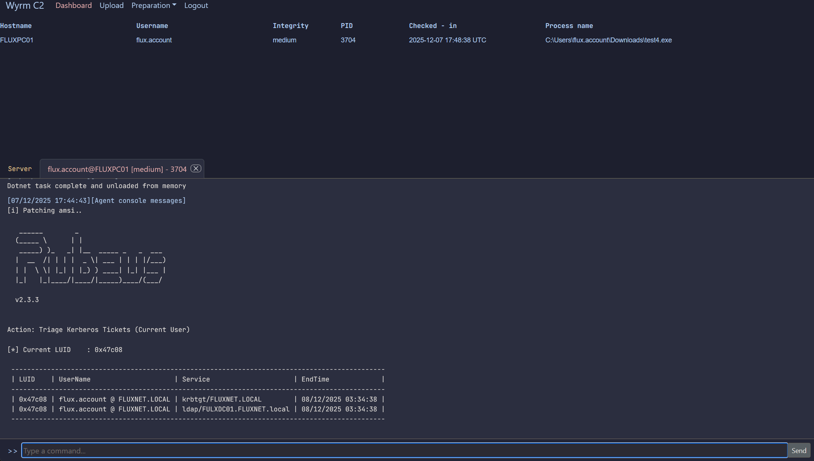

# Dotex In-Memory .NET Execution

## Overview

`dotex` allows an operator to execute a .NET binary entirely in memory inside the implant process. No file is ever written to disk, making this a stealthy alternative to conventional process creation.

This command currently executes the .NET payload in the implant’s own process, so long-running or never-returning assemblies may cause the implant to become unresponsive or lost.



### Usage

```shell
dotex <binary> <args>
```

Where:

- <binary>: Name of the staged .NET assembly (e.g., Rubeus.exe)
- <args>: Arguments passed directly to the managed entry point

Example: `dotex Rubeus.exe klist`

## Staging .NET Assemblies 

Before execution, the .NET binary must be staged so the C2 can serve it to the implant.

On the host machine where the Wyrm C2 server is installed (i.e., outside Docker), you will find `<Wyrm Root>/c2_transfer/`.

Any file placed in this directory is automatically synchronized into the C2—no restart required.

### Steps to stage

1) Locate the c2_transfer folder in your Wyrm root.
2) Drag and drop your `.exe` dotnet binary into the directory.
3) The C2 will automatically pick it up.
4) Invoke it from an agent using dotex <binary> <args>.

## Important notes

- **In-Process Execution**: The .NET assembly runs inside the implant's process. If the assembly never returns (e.g., a long-running loop or interactive prompt), the implant may stop responding.
- **No Disk Artifacts**: The binary is never written to disk on the target host.
- **Operator Responsibility**: Ensure the payload you run is well-behaved. An infinite loop or blocking call inside the .NET assembly will cause the beacon to be lost.