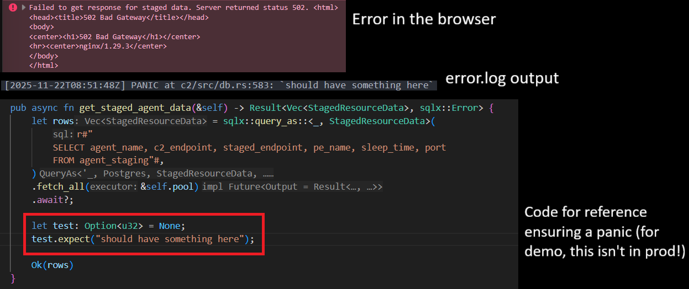

# FAQ

### I deleted my containers and reinstalled the C2 but I get an error saying a migration failed when trying to start the C2.

Make sure you delete your docker volumes as well as containers when doing a fresh build.

### I have built this on localhost but I cannot login and/or a beacon will not call back?

You most likely have not configured your TLS certificates for use on localhost. 
I have [provided a guide](https://fluxsec.red/wyrm-c2-localhost-self-signed-certificate-windows) on how to do this - ensure you follow that.
If you have followed that correctly, please raise an issue on the [repo](https://github.com/0xflux/Wyrm).

### My client received a 502 error from the C2, what has gone wrong?

A 502 generally indicates in this ecosystem a panic (either explicit or via a `.unwrap()` or `.expect()`). Check the error logs in your `C2` Docker container under `/data/logs/error.log`. For example, a 502 is returned by me entering a `.expect()` somewhere which is guaranteed to fail for demonstration purposes:

