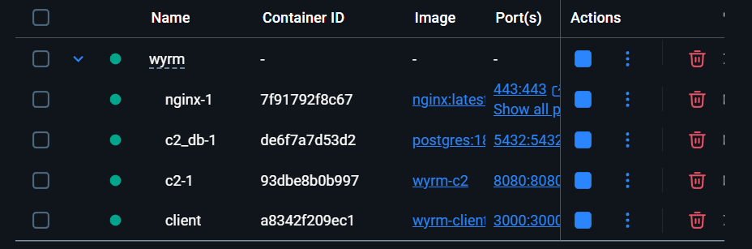
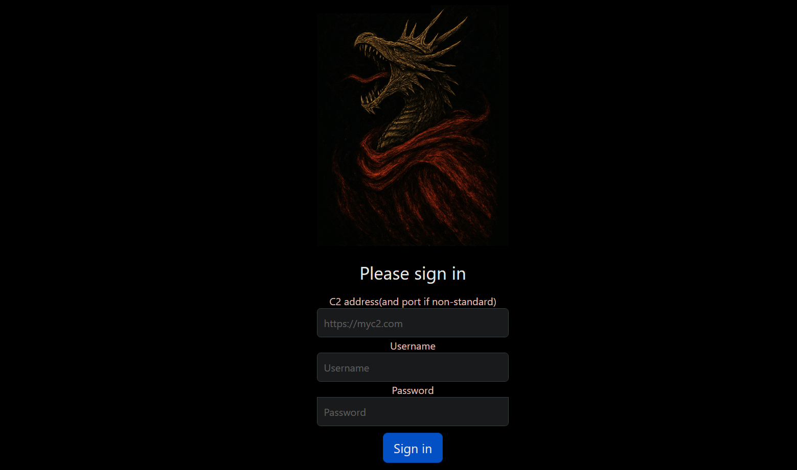
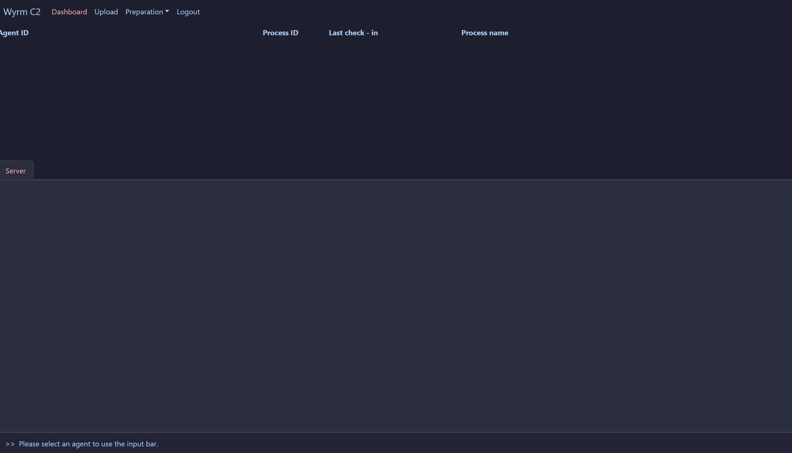

# Logging In

Now you should have all containers running, such as:

To login, navigate to: http://localhost:3000 and you will be presented with the login page.

To login, simply enter the address of the C2, ensure you include the `https://` prefix, and your username and password.
If this is your **first time** logging into the C2, the username and password you provide will be the 
**credentials used on the C2 hereafter** to login.

If successful, you will be redirected to the dashboard.

