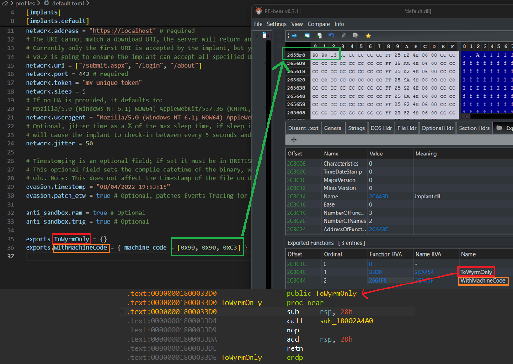

# Custom exports

As of version 0.4.4 of Wyrm, you can now define custom exports on built DLL's. Through the profile, you have two options:

- Create a custom export for launching the main Wyrm payload. Note that this will remove the default export of `run`. You can specify as many of these as you wish.
- Create a custom export, with accompanying machine code. This would mostly be useful as an anti-analysis tactic, or to run some custom shellcode (such as  starting a loader for something).

If you wish to see the implementation notes on this, check it out on my blog!

This image here shows the result of doing this, explained below.



### A note on DLLs and exports

DLLs are essentially executables, just without the main entry function. They are mostly (almost exclusively) used to provide programs with
additional functionality and capabilities from code that was not provided in the main binary. An example, albeit poor, is if you wrote
a math function which adds two numbers - lets say you didn't want to have to repeat this code in all your programs, you could export that
code as a DLL and import it into programs you wish to have add numbers together.

This exported function in a DLL is referred to as an export, and exists in the DLL's export table. You can view DLL exports with tools like
**dumpbin**, **disassemblers**, or [[PE Bear](https://github.com/hasherezade/pe-bear)](https://github.com/hasherezade/pe-bear).

Wyrm builds executables, but also DLL's, which opens much more slippery techniques such as [DLL Sideloading](https://attack.mitre.org/techniques/T1574/001/).

## Syntax

If you wish to configure the DLL to use these exports through the GUI, then you modify your profile adding the below into your implant
section.

### Export only

Each export must start with `exports`, followed by the name of your export. In the example above, we have two exports on the DLL,
`ToWyrmOnly` which has no associated machine code body, and `WithMachineCode` which does. 

So, if we wanted to add a DLL export to start Wyrm (and in turn, throws out the `run` export) you would key this as:

```toml
exports.WithMachineCode = {}
```

The `= {}` is necessary to conform with toml requirements. Doing this style of export will simply launch the entry code of Wyrm when you call that
`WithMachineCode` export (either from Search Order Hijacking, RunDll, or via your own code).

### Export with machine code

If you wanted to include your own machine code (shellcode) which is associated with the export, you can do so with the following syntax:

```toml
exports.WithMachineCode = { machine_code = [0x90, 0x90, 0xC3] }
```

Here, we write 2 `nop` instructions, followed by a `ret`. This is a poor example for real world use. In the real world, this is probably best used
to write some decoy code to compile into the DLL to potentially slow down analysis efforts of a blue team you are testing (if they have
the maturity for such analysis, or you are emulating an APTs' TTPs).

One way to do this would be to write some **nostd** Rust code, or some C code, and compile it to just an `.obj` file without linking. You could then
copy the bytes of your function into the `machine_code` field above.