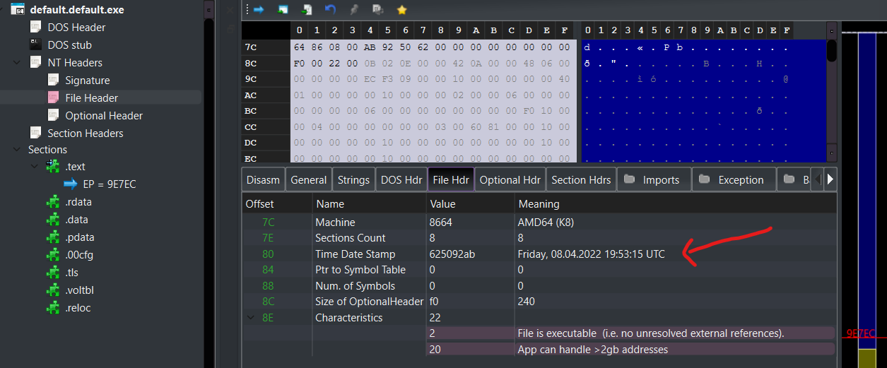

# Obfuscation

Obfuscation (my definition) is the act of hiding something either through deception or making something so complex it becomes a chore
for a human to analyse (either manually, or to create automation for).

The below profile keys will assist you in obfuscating the post exploitation payload (not concerning droppers / loaders, etc).

Please refer to the parent page to see where the relevant keys should go in the `toml`.

## Timestomping

[Timestomping](https://attack.mitre.org/techniques/T1070/006/) is the act of modifying timestamps of a file, artifact or metadata 
which is often done to hide changes to the system, or outright cause deniability. I have 
written a [blog post about timestomping](https://fluxsec.red/timestomping-pe-compile-time) in more detail if you are interested!

To timestomp the binary, you can use the `timestomp` key with a british date/time format as follows:

```toml
evasion.timestomp = "08/04/2022 19:53:15"
```

This will change the Time-Date Stamp in the binary as follows:



## String scrubbing

String scrubbing allows you to either remove, or replace strings that get compiled into the binary. This may be useful for some in memory
evasion, replacing strings which are fingerprinted as part of Yara rules etc. **Use this with care**, this could break things in the binary
so make sure you test it after building. As an example, I replaced an instance of `C:\\powershell` with a fake string, and this prevented
running powershell from the agent.

You must escape backslashes in this - so, if your target replacement has one backslash: `\`, then you will need two `\\`. If the target
has two backslashes, then equally you must use four: `\\\\`. Note that this string scrubbing utility does **not** include unicode strings.

You have two options with this, `string_stomp.remove` and `string_stomp.replace`.

### string_stomp.remove

To fully remove strings from the binary, you can add each item in a list like so, under the implant profile:

```toml
string_stomp.remove = [
    "library\\std\\src\\thread\\scoped.rs",
    "Another string here",
]
```

### string_stomp.replace

To use the replacer, it is easier to mark an area in the toml for this with `[implants.default.string_stomp.replace]` heading,
containing underneath it, containing `(string to target) = (what to replace with)`. Such as:

```toml
[implants.default.string_stomp.replace]
"library\\std\\src\\thread\\current.rs" = "string_one"
"Some\\path\\here" = "string_two"
```