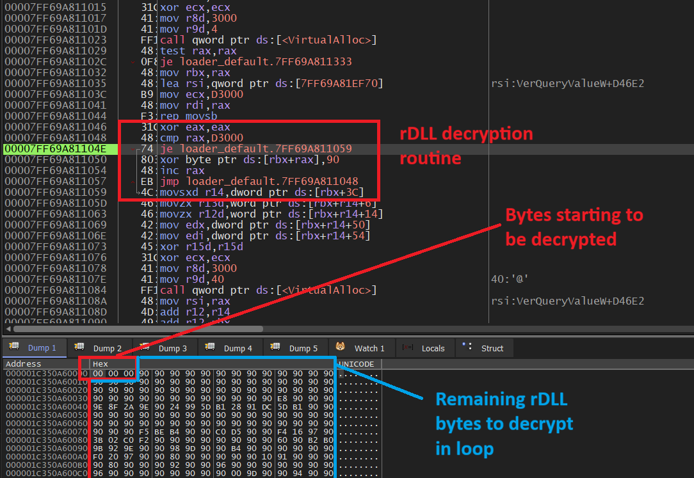
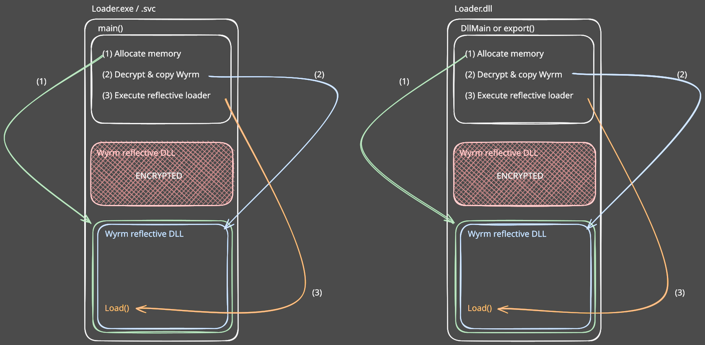

# Wyrm Loader

The implant primarily is prepared to be a reflective DLL which means it can load itself when a thread is spawned over its reflective entry.

Currently, the reflective entrypoint is the export `Load`, meaning the PE must be mapped into memory, and then a thread runs over `Load`. 
The `Load` export is fully position independent and does not rely on the standard library, meaning nothing needs to be set up specially
for it to work.

The loader packs the Wyrm post exploitation payload into an encrypted region of memory which when compiled, is placed into the **.text**
section of the binary, **not** into **.rdata**. This was chosen as EDR's typically scrutinise the .rdata and similar sections for signs of
packed / encrypted binaries / high entropy, etc. This in theory should make the payload more resilient against EDRs.

At compile time when the loader is built, it also stomps the DLL signatures of the rDLL section again, to help combat EDR's looking too
closely at signs of rDLL injection.

The rDLL (still at compile time) is XOR encrypted using the **NOP** OPCODE (0x90) in place. This was chosen as it's a very common OPCODE
in the .text section so should help the encrypted payload to blend in, albeit it now is invalid assembly. I will be interested if 
the Red Team / pentest community try this out against EDR's to see how it fairs.

When the loader runs, it will begin by allocating memory in its own process and it will decrypt the PE (with stomped headers) as 
below:

The loader will then resolve the relevant exports, and jump to the `Load` export, which is position independent in that execution 
can arbitrarily start from that location. The thread of execution will then resolve and realign the DLL, and it can run as normal.

Visualised:

